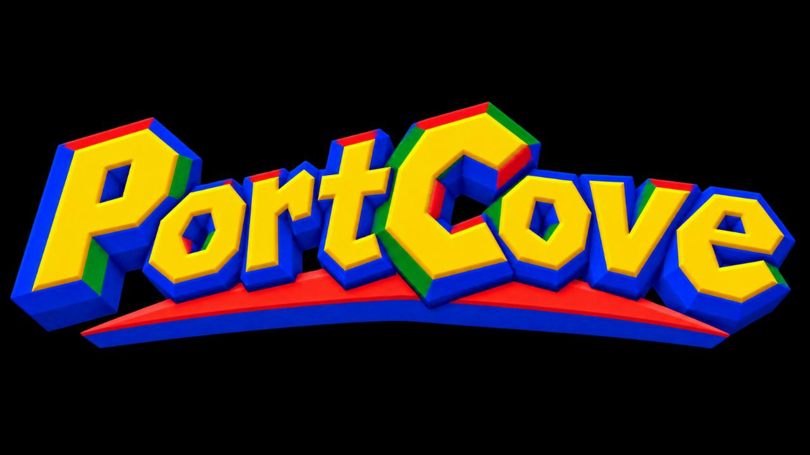

<p align="center">
  
</p>

<h1 align="center">Portcove</h1>

<p align="center"><strong>Native ports, kept current.</strong><br>Verified releases, local-only source handling, safe updates, rollback, and one automation contract for the desktop and CLI.</p>

Portcove is a local-first manager for native PC ports, decompilation projects, and static recompilations. It combines a reusable Rust core, an automation-friendly CLI, and a controller-friendly Tauri 2 desktop app.

This repository is an early, working implementation. Catalog and state commands are usable; downloading a project is intentionally rejected unless its upstream release supplies a SHA-256 digest or checksum sidecar. Each catalog entry still needs an end-to-end release qualification on every declared platform before Portcove should be presented as production-ready.

## What is implemented

- Stable, beta, and rolling channels selected per port.
- Notify, stage, and automatic update policies with an unattended `reconcile` command.
- Failure-isolated bulk update checks, policy reconciliation, updates, and source verification for unattended frontends.
- GitHub release discovery with active-upstream checks and a checksum-pinned retired-project path.
- Optional GitHub device login, secure token storage, rate-limit visibility, and persistent conditional-request caching.
- Mandatory SHA-256 validation and safe ZIP/TAR extraction.
- Versioned installs, explicit staged-update activation, verification, rollback, and preserved user data.
- Transactionally published, versioned persistent-data backups and confirmed restore through both CLI and desktop, with tree integrity checks and automatic pre-restore safety snapshots.
- Source records referenced in place, never uploaded, and checked against their registered size and SHA-256 on demand and before reuse; when an upstream runtime requires its own validated local copy, that copy stays inside the local Portcove user-data tree.
- Safe adoption by copying an existing installation without changing the original.
- JSON, JSONL, JSON Schema, deterministic exit codes, and a network-free `exec` path for launchers such as Batocera, Playnite, LaunchBox, RetroBat, and EmuDeck.
- A local, read-only `doctor` report for host platform, library capacity, catalog state, optional `chdman`/DolphinTool discovery, and explicit repair planning for incomplete or ambiguous library state.
- Cross-process per-port operation locks so multiple launchers cannot race installation state or mutate a port while its game process is running.
- Parent-independent desktop launch supervision with durable crash recovery, exact-version save collection, and CLI signal forwarding.
- Tauri 2/React desktop UI with keyboard and controller navigation.
- Successful-exit launch history shared by CLI and desktop, with a real Continue action that never promotes failed starts or crashes.
- Durable operation activity and recoverable cross-store lifecycle journals shared by CLI and desktop, with stable sequenced progress identities for overlapping and nested work.
- Content-addressed install identity, current-byte executable checks, and one bounded collision-aware archive policy shared by release and private-toolchain extraction.
- Native file and folder pickers for source registration and safe adoption, while retaining pasteable paths.
- Confirmed desktop removal of managed versions while preserving saves, configuration, mods, and original sources.
- GUI Update Center with failure-isolated bulk checks, per-port policy reconciliation, and persistent update awareness shared with CLI checks across restarts.
- GUI source readiness and integrity with one-place missing source/BIOS onboarding for installed ports, a read-only failure-isolated bulk verifier, and validated source-reference replacement.
- Platform-specific automated and physical qualification evidence; deferred manual checks are never presented as completed.
- Cross-platform draft releases with separate automation-friendly CLI archives, native Tauri bundles, and per-platform SHA-256 manifests.
- CHD validation through explicitly configured or locally discovered MAME, Batocera, EmuDeck, and RetroBat tooling, plus normalized GameCube ISO validation through DolphinTool, with no silent binary downloads.

## Build

Requirements: Rust 1.88 or newer, Node 24, pnpm 11, and the [Tauri 2 platform prerequisites](https://v2.tauri.app/start/prerequisites/).

On Windows, keep the development checkout on a non-system volume. The storage preflight prints the resolved Cargo, temporary, pnpm, and packaging paths and blocks heavy work that would write them to the Windows system drive. See the [development-storage workflow](docs/DEVELOPMENT-STORAGE.md) before the first build or when migrating an existing checkout.

```powershell
fnm use
node scripts/dev-storage.mjs preflight
node scripts/dev-storage.mjs run -- pnpm --dir apps/desktop install --frozen-lockfile
node scripts/dev-storage.mjs run -- pnpm --dir apps/desktop build
node scripts/dev-storage.mjs run -- pnpm --dir apps/desktop desktop:dev
```

Build and test the Rust workspace from the repository root:

```powershell
.\scripts\bootstrap-quality-tools.ps1
just check
node scripts/dev-storage.mjs run -- cargo build -p portcove-cli --release
```

Linux and macOS developers can use `./scripts/bootstrap-quality-tools.sh`. Use `just audit` before substantial work is considered complete and `just deep` for large structural changes. See the [quality and codebase-intelligence guide](docs/QUALITY.md) for the deterministic/advisory boundary and current ratchet baseline.

After a Windows Tauri bundle build, its isolated unsigned install/launch/uninstall lifecycle can be repeated without touching an existing Portcove library:

```powershell
.\scripts\test-windows-installer.ps1 `
  -InstallerPath .\target\release\bundle\nsis\Portcove_0.1.0_x64-setup.exe `
  -TestBase E:\Portcove-Installer-Qualification
```

Before creating a release tag, run the complete metadata, test, catalog, bundle, and installer gate documented in [docs/RELEASING.md](docs/RELEASING.md).

## CLI examples

```powershell
portcove about
portcove --json capabilities
portcove --json auth status
portcove auth login
portcove --json catalog export
portcove --json catalog show lighthouse
portcove source add banjo-kazooie D:\Sources\banjo.z64
portcove --json source verify --all
portcove --json activity --limit 25
portcove --json storage
portcove --json doctor
portcove --json plan lighthouse
portcove --json paths lighthouse
portcove --json backup create lighthouse
portcove --json backup list lighthouse
portcove --json backup restore lighthouse <backup-id> --yes
portcove --json backup delete lighthouse <backup-id> --yes
portcove channel set re-blue rolling
portcove policy set lighthouse notify
portcove --jsonl reconcile lighthouse
portcove --json check --all
portcove --json update --all --stage
portcove install lighthouse
portcove activate lighthouse
portcove exec lighthouse -- --fullscreen
```

Set `PORTCOVE_LIBRARY` or pass `--library` to give another frontend a private or shared library root. See [docs/CLI.md](docs/CLI.md) for the machine contract.
For unattended release checks, `PORTCOVE_GITHUB_TOKEN` avoids GitHub's low anonymous API allowance without storing the token in Portcove state. Interactive tokens are kept in the operating-system credential store. GitHub device login becomes available when the build is given the public `PORTCOVE_GITHUB_CLIENT_ID`; anonymous and token modes do not depend on it.

## Design boundaries

Portcove does not distribute copyrighted game data, bypass source ownership checks, or silently modify an adopted installation. Retired projects require immutable checksum-pinned direct manifests; superseded and abandoned projects fail closed. The embedded catalog is data rather than port-specific control flow; see [docs/CATALOG.md](docs/CATALOG.md) and the approved [V1 game cutoff](docs/V1-CUTOFF.md).

The architecture and trust boundaries are documented in [docs/ARCHITECTURE.md](docs/ARCHITECTURE.md). The desktop product direction and direct competitor baseline are recorded in [docs/GUI-COMPETITIVE-REVIEW.md](docs/GUI-COMPETITIVE-REVIEW.md), the N64-inspired semantic color contract is documented in [docs/THEME.md](docs/THEME.md), and artwork usage and derivative provenance live in the concise [brand guide](docs/BRAND-ASSETS.md). Security reports belong in the process described by [SECURITY.md](SECURITY.md).

Interactive, physical, and external-infrastructure follow-ups are tracked in [docs/DEFERRED.md](docs/DEFERRED.md). Treat that file as the authority for intentionally postponed work rather than inferring completion from automated tests.

Licensed under MIT or Apache-2.0, at your option.
