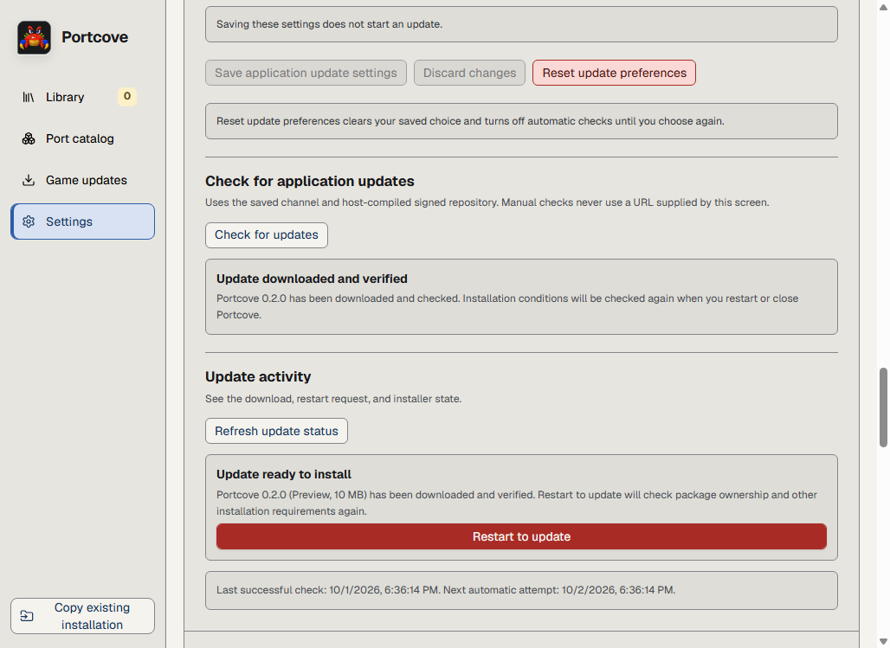

# An installed application update and staging recovery

This is an actual installed Windows test build on October 1, 2026, using a
private disposable update feed. **These test versions are not published
releases.** The released Alpha 2 still uses the [manual upgrade
procedure](../../UPGRADING.md#upgrade-portcove).

## Download, restart, and confirm

The installed **0.1.0** application opened **Settings > Application updates**.
The exercise saved **Preview** and **Manual** settings, checked for updates,
then downloaded and verified the **0.2.0** candidate through the application.
Saving settings alone did not start an update.



This unchanged screenshot captures the state **before restart**. A verified
download is ready for installation; it does not mean the running application
has changed. **Restart to update** rechecks installation conditions before
replacement. Any platform security prompt remains under the operating system's
control; this elevated test does not demonstrate ordinary-user prompt handling.

After that action, the retained evidence identifies the restarted Tauri
application as **0.2.0**, with the expected executable bytes and one matching
per-user installation registration. The updated application passed a subsequent
startup check and closed normally, exit code **0**. The screenshot itself does
not show this post-restart result; that result comes from executable, process,
registration, and reconciliation readbacks in the run below.

## Recover damaged staging without replacing the application

Before the successful update, the exercise supplied a one-byte truncated
candidate. It was refused, leaving staging empty and the predecessor executable
and fixture marker unchanged. A separate damaged staging journal then exercised
these existing commands against the installed desktop executable:

```text
portcove-desktop --application-update-recovery status
portcove-desktop --application-update-recovery repair staging
portcove-desktop --application-update-recovery status
```

The first status returned **1** and specifically named `repair staging`. The
repair returned **0** and reported that the damaged staged payload and journal
were cleared and a fresh verified download was required. The final status
returned **0** and reported healthy application update coordination state.
These operations did not check a feed, download, install, restart, or open a
native prompt. The installed predecessor remained **0.1.0** with its original
executable hash and fixture marker.

For your own installation, close all Portcove windows and run **status first**;
perform only the repair it actually names. Healthy coordination state does not
prove a healthy library or roll back a library migration. See the [complete
recovery procedure](../../UPGRADING.md#application-updater-recovery-without-the-gui).

## Exact evidence and limits

- Implementation: [#1362](https://github.com/boburning/portcove/pull/1362), source
  `e90e6b9147025ecbdc77c7ab83ec6728ea9d0c7f`.
- [Installed rehearsal run 36898680617, attempt 1](https://github.com/boburning/portcove/actions/runs/36898680617),
  artifact **11185791938**, `updater-rehearsal-windows-x86_64`. The artifact contains
  the original `windows-renderer-evidence/before-restart.png`, renderer receipt,
  installed-update receipt, inventory, and installer bytes. Retained receipts
  were checked against the exact run, source, versions, and bytes before this
  capture was published. The recovery results above are transcribed from that
  receipt; no terminal recovery screenshot was captured.
- Candidate installer: **10,504,537 bytes**, SHA-256
  `6c04fe842f501300c50ba631a5b7591a682acfecbef7449e1203e8381d6fdc6b`.
  Replaced/restarted executable SHA-256:
  `c9f1bfcb56edb5f2f20893bda874f2a7b2324840f9d8eca3de76d04507b54539`.
- Environment: elevated hosted **Windows 10.0.26100, x64**, disposable signatures
  and feed, Authenticode **NotSigned**, existing opt-in embedded WebDriver
  qualification transport. Test access is not a shipping feature. No feed,
  credential, signing key, private path, or proprietary input is published here.
- Library/preferences fixture markers survived; before/after uninstall
  preservation manifests matched. This is not real ROM, game, or save
  compatibility evidence. The restarted candidate and installer helper were
  already absent when retained handles were sought; their independent OS exit
  codes remain unproven. The separate updated-app startup/close observation above
  does have an observed exit code.
- This establishes an adjacent installed **0.1.0 to 0.2.0** Windows test transition
  and these two staging failure boundaries. It does not establish production
  feeds or signing, ordinary nonadministrator behavior, all interruption cases,
  minimum supported Windows versions, macOS/Linux, physical devices, or novice
  comprehension. Passing startup does not fix earlier startup timing failures.

Broader updater and documentation acceptance remains with
[#224](https://github.com/boburning/portcove/issues/224) and
[#209](https://github.com/boburning/portcove/issues/209).
