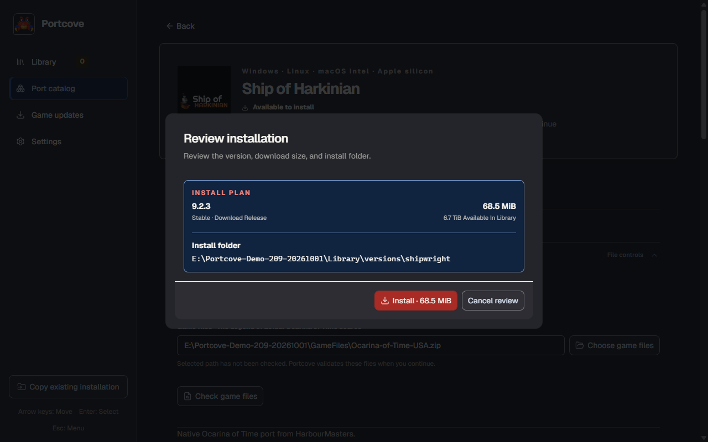
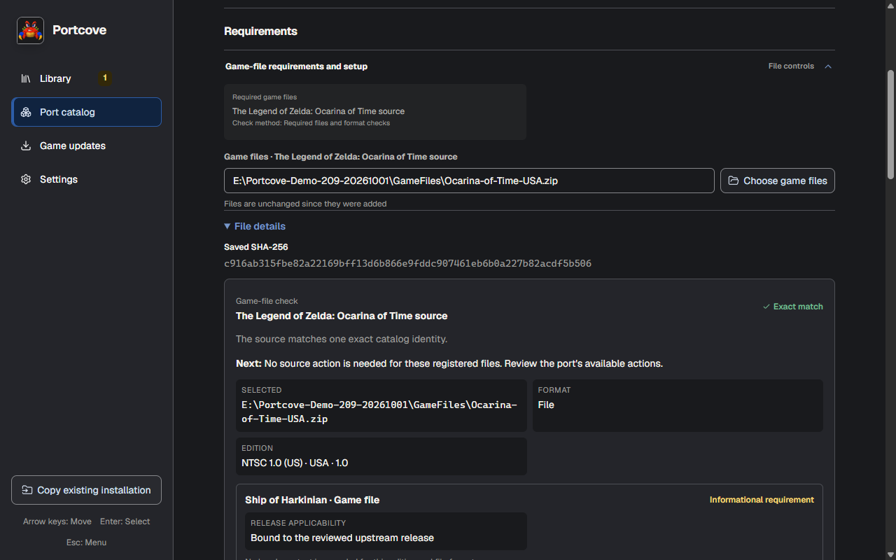
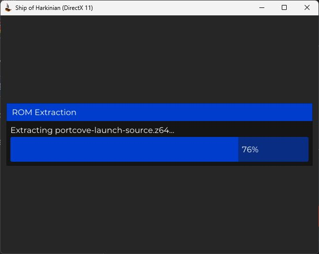
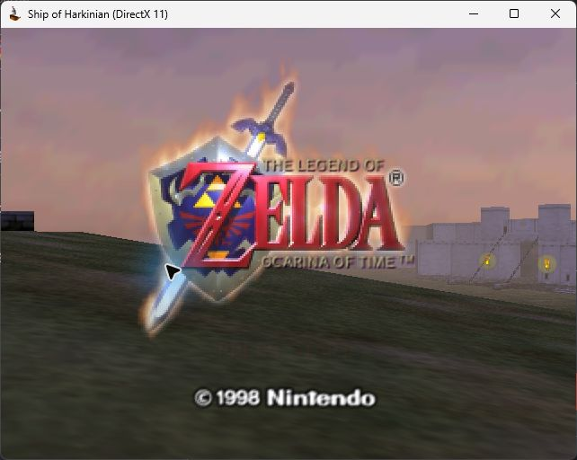
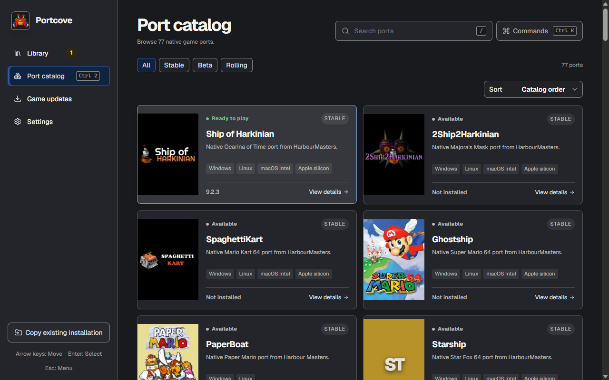

# A real first-launch journey

These are unchanged captures from the Windows development application on October
1, 2026. The catalog image is also used in the project README. The capture uses a
fresh disposable library and preferences, and an authorized local copy of the
user's game file. No ROM, save, credential or private NAS location is published.

## What happened

1. Opened Ship of Harkinian in the actual Port catalog and entered the local
   game-file path in its visible field.
2. Reviewed version **9.2.3**, a **68.5 MiB** download, and the disposable install
   destination. Confirmed Install through the real application.
3. Portcove verified `SoH-Ackbar-Delta-Win64.zip` and reached **Ready to play**.
4. Chose Play. The actual game extracted its prepared source, asked whether to
   run, and reached the Ocarina of Time title screen after confirming Yes.
5. Closed the game normally. Portcove returned to **Ready to play**; its managed
   launch record reports `succeeded`, exit code **0**, and a finish time.
6. Inspected the registered source's exact-match details, then returned to the
   catalog. Closed Desktop normally, exit code **0**, with no forced shutdown.

The source check below was inspected **after installation**, not presented as a
separate pre-install dialog. It identifies **NTSC 1.0 (US), USA, 1.0**. The NAS
original and the disposable local ZIP were hashed before and after the journey
and remained byte-identical. The existing native session helper checked owned
process identities and quiescence; Desktop, game and supervisor PIDs were absent
after normal closure.

### Review the destination

### Inspect the accepted source

### Let the game finish its first-launch preparation

### Reach the real game

### Return to the catalog

## Build and evidence limits

- Application source: `20febf86d9b730f86fc9fe594eb5d8b10db62955`.
- Development executable SHA-256:
  `2aeb11ca131907b95e9b839d9f03f002ad07212580174e33c9f549fe624e5547`;
  62,794,752 bytes. Built with `tauri/custom-protocol` and the existing opt-in
  `native-compatibility-qualification` feature. The capture endpoint belongs to
  this qualification build; it is not a shipping endpoint.
- Upstream package SHA-256:
  `cc7bd5ada1332be50013976fc3db3289cacde1df57e7e6cf73d4a1df81313e30`;
  71,870,265 bytes. Portcove recorded it as verified and active, not staged.
- Existing embedded Windows WebDriver captured actual application screenshots
  and visible text. Computer Use operated the application and game and captured
  the game's preparation/title windows. These are not component scenarios or
  invented screenshots. Three original PNGs and two original JPEGs are published
  without image edits.
- The native file picker exposed inconsistent focus information to Computer Use.
  Its dialog was cancelled; the visible application path field was used instead.
  This establishes that route, not automated picker completion. An earlier
  capture-module import failed because the Computer Use JavaScript environment
  has no `process` global; it launched no application. Its evidence was retained,
  and the normal Node host then used the existing native session helper.
- Covers and interface reflect this development build, including real IGDB
  artwork and generated fallback, and are newer than Alpha 2. No manually imported
  artwork was added for this capture. Artwork attribution remains available in
  the application; [IGDB](https://www.igdb.com/) supplies the default images.
- This is Windows native development-app and real first-launch evidence. It is
  not Alpha 2 installed-package qualification, an application updater transition,
  minimum-platform certification, Steam Deck or physical-controller evidence,
  gameplay/audio/save compatibility, or novice comprehension evidence.

The capture preserves useful failure and recovery boundaries. It does not fix
the separately recorded native startup or image-availability diagnostics merely
because this journey succeeded. Broader documentation and beta obligations remain
with [#209](https://github.com/boburning/portcove/issues/209) and their existing owners.
